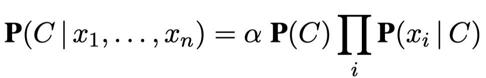

## The MNIST Dataset


The MNIST dataset consists of 70,000 greyscale images of handwritten digits 0-9. Each image contains 28x28=784 pixels, and each pixel has a value 0-255. 60,000 images are used for training, and the remaining 10,000 are used for testing. 

Two files ```mnist_train.csv``` and ```mnist_test.csv``` from the dataset are needed to run the code. They're too large to be uploaded and can be downloaded [here](https://www.kaggle.com/oddrationale/mnist-in-csv). 

## Naive Bayes
The [naive Bayes](https://en.wikipedia.org/wiki/Naive_Bayes_classifier) model is probably the most common Bayesian network model used in machine learning. The model is “naive” because it assumes that the attributes are conditionally independent of each other given the class. With observed attribute values (pixel values, in this case) x1, x2, ..., xn, the probability of each class C is given by: 



A prediction can then be obtained by choosing the most likely class. 

## Run
```
python3 naive_bayes_mnist.py
```

#### With Graphics
```
No.1
Predict: 7
Actual: 7
Accumulative precision: 1.0
                            
                                                                            
                                                                                    
      -#*+:.                
      %@@@@@########*:      
      :=:=*%@%@@@@%@@+      
            : :::: @@=      
                  -@%       
                  %@-       
                 =@@.       
                :@@:        
                +@#         
                #@:         
               =@#          
              :@@:          
              %@*           
             #@%.           
            .@@:            
           .%@=             
           +@@:             
          :@@@:             
          =@@%.             
          =@#               
              
              
              
Press enter to continue.
No.2
Predict: 2
Actual: 2
Accumulative precision: 1.0
                            
                            
                            
          ==*@@+-           
         *@@@@@@%.          
        *@@@%+*@@=          
       :@@%.   #@+          
       :@%    =@@:          
        .     %@@:          
             =@@#           
            :@@%:           
            =@@+            
           *@@*             
           @@%.             
          #@@+              
         -@@#               
         #@@+               
        +@@*                
        @@@                 
        @@@.         .++++  
        @@@@@@@@*+*@@@@@@@= 
        *@@@@@@@@@@@@@@*==: 
         ====*@@@+==.       
                            
                            
                                                                                
Press enter to continue.
No.3
Predict: 1
Actual: 1
Accumulative precision: 1.0                            
                            
                            
                            
                .@=         
                -@-         
                +@          
               .@+          
               -@:          
               #%           
              .@%           
              -@#           
              +@:           
             :@#            
             =@*            
             *@-            
             %%             
            =@*             
            +@+             
            %@:             
           :@@:             
           +@#              
           %@=              
           #*               
                            
     
                                                                
...
...
...


No.9998
Predict: 9
Actual: 4
Accumulative precision: 0.8450690138027606
                            
                            
                                                                                                                
            %%.    =@+      
           =@%.   :@@       
          =@@:   .@@#       
         .%@@:   +@@+       
         *@@#   :@@@.       
         @@@:   %@@*        
        .@@%   -@@@.        
        +@@@**#@@@@-        
        =@@@@@@@@@@@.       
         %@@@@@@@@@@.       
         .-##@@@@##-        
            .@@@#           
            *@@@-           
           .@@@#            
           #@@@-            
          .@@@#             
          +@@@+             
          *@@%.             
          *@@+              
          -@%.              
                            
             
             
No.9999
Predict: 8
Actual: 5
Accumulative precision: 0.844984498449845
                                                        
                                                                                    
                                                                                     
              -        ===: 
           =@@@*:=:=**@@@@@ 
          :@@@@@@@@@@@@@@@- 
          -@@@@@@@%*@#+=..  
         .%@@#*=.           
         -@@@@+.            
          %@@@@@-           
          .+#@@@+           
        @=   .#@@.          
       =@*    *@@=          
       @@:   -@@@           
       #@+:  :@@@.          
       -@@%=+@@@*           
        +@@@@@@*            
         -#@@@+             
           --.              
                            
                            
                                                        
No.10000
Predict: 6
Actual: 6
Accumulative precision: 0.845
                   
                   
                            
                  =@%-      
                -%@@@*      
              -%@@@@=       
           .-#@@@@#:        
         .#@@@@@@#          
          ::*@@@#           
           :@@@@            
          :#@@#-            
         -%@@@+             
        =@@@@.              
       -@@@@-               
       =@@@#      *@@@%     
      .%@@+:   .**@@@@@*    
      *@@@. .*%@@@@@@@@@    
      %@@# *@@@@@#@%%@@*    
      %@@%-@@@#:: :.#@@:    
      @@@@%@@@----=%@@+     
      =@@@@@@@@@@@@@@+      
       *@@@@@@@@@@@*:       
        .+%@@@#+++=         
                            
                            

```

#### Without Graphics
```
No.1
Predict: 7
Actual: 7
Accumulative precision: 1.0
Press enter to continue.
No.2
Predict: 2
Actual: 2
Accumulative precision: 1.0
Press enter to continue.
No.3
Predict: 1
Actual: 1
Accumulative precision: 1.0
Press enter to continue.
No.4
Predict: 0
Actual: 0
Accumulative precision: 1.0
Press enter to continue.
No.5
Predict: 4
Actual: 4
Accumulative precision: 1.0

...
...
...

No.9995
Predict: 1
Actual: 1
Accumulative precision: 0.8451225612806403
No.9996
Predict: 2
Actual: 2
Accumulative precision: 0.8451380552220888
No.9997
Predict: 3
Actual: 3
Accumulative precision: 0.8451535460638191
No.9998
Predict: 9
Actual: 4
Accumulative precision: 0.8450690138027606
No.9999
Predict: 8
Actual: 5
Accumulative precision: 0.844984498449845
No.10000
Predict: 6
Actual: 6
Accumulative precision: 0.845
```

### Reference
Stuart Russell and Peter Norvig. Artificial Intelligence: A Modern Approach (3rd ed.).
